传统机器学习
===

# 1.K近邻算法-KNN
| 鸢尾花分类 | 海伦约会分类 | 西瓜数据分类 | 随机曲线回归 |
| ---------- | ------------ | ------------ | ------------ |
| 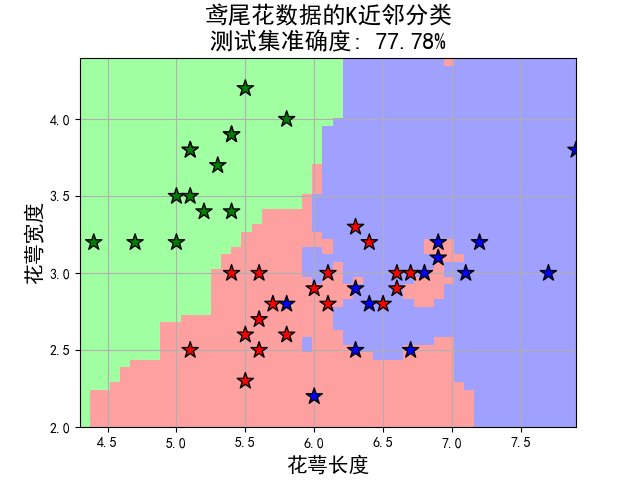 | 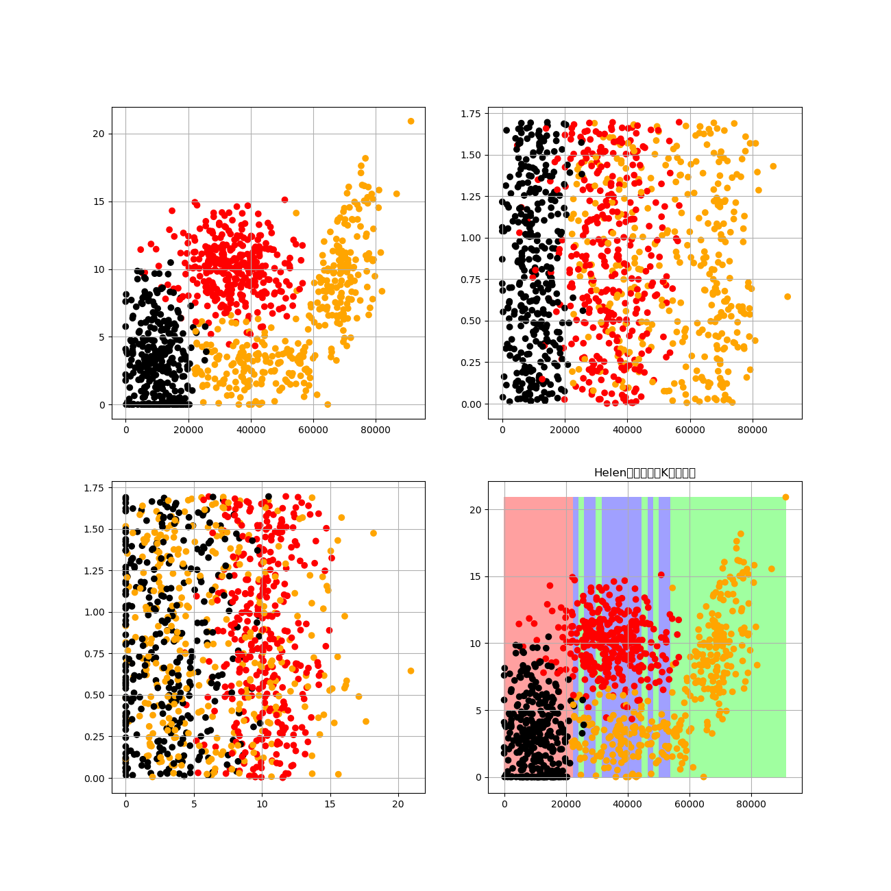 | 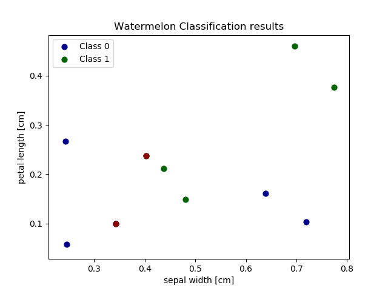 | 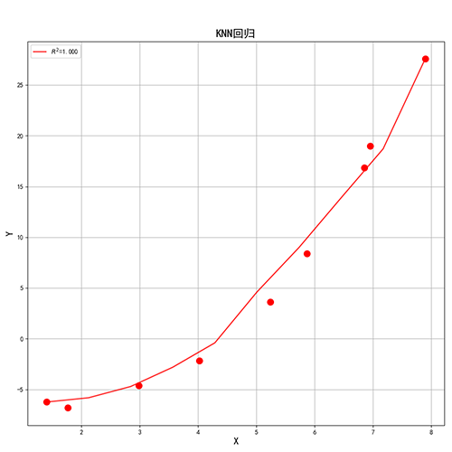 |

# 2.线性回归-Linear Regression
| 线性加权的线性回归 |
| ------------------ |
| 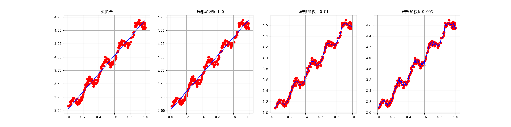 |

## 通过弹性网来预测波士顿房价
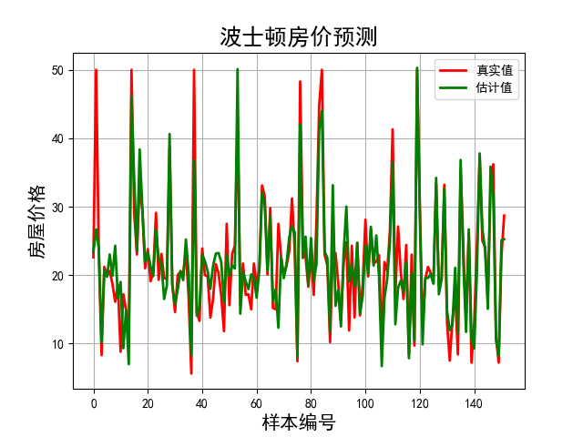

# 3.逻辑回归-Logistic Regression
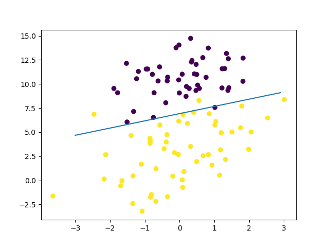

# 4.决策树-Decision Tree
## 鸢尾花分类
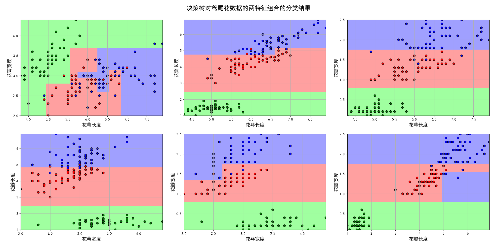

## 心形图案拟合
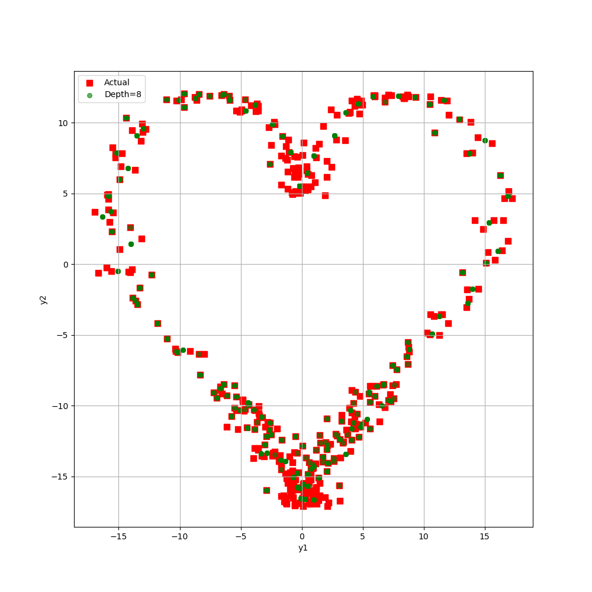

# 5.Bagging算法与随机森林
## 决策树、Bagging算法和随机森林的比较
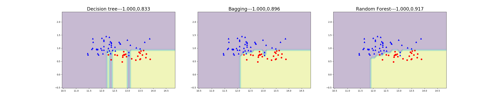

## 随机森林分类鸢尾花数据
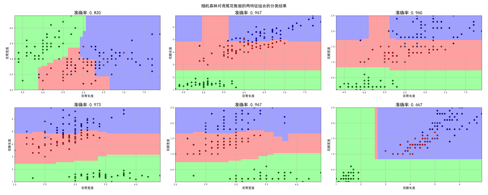

## 随机森林拟合随机曲线
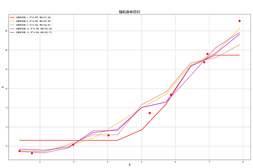

# 6.提升算法-Boosting
## Adaboost算法
| AdaBoost鸢尾花分类 | AdaBoost曲线拟合 |
| ------------------ | ---------------- |
| 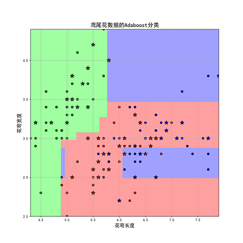 |  |

## 梯度提升树算法
| GBDT鸢尾花分类 | GBRT曲线拟合 | Python版GBRT拟合 |
| -------------- | ------------ | ---------------- |
|  | 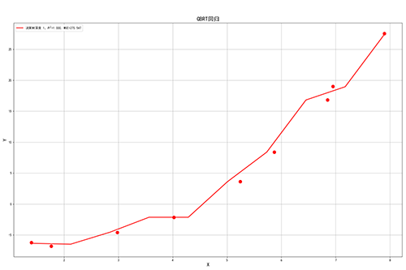 | 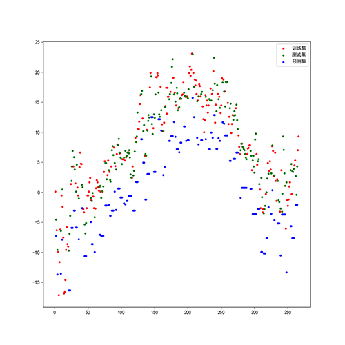 |

鸢尾花分类错误率
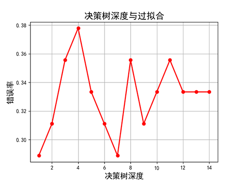

## XGBoost曲线拟合

# 8.支持向量机-SVM

# 9.聚类-Cluster

# 10.EM算法

# 11.朴素贝叶斯算法

# 13.综合
