深度学习
===
本节包含图片的分类、识别、分割，自编码器以及各种对抗生成网络。

# 1.基础

# 2.图片分类

# 3.图片识别

# 4.图片分割

# 5.自编码器

# 6.人脸识别

# 7.对抗生成网络
## 7.1.GAN
 
 

## 7.2.DCGAN
### $28 \times 28$
| 动画 | 10 Epochs | 50 Epochs | 100 Epochs |
| ------- | ------- | ------- | ------- |
|  | 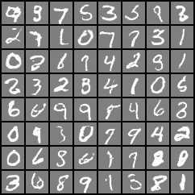 |  |  |

### $32 \times 32$
| 动画 | 10 Epochs | 50 Epochs | 100 Epochs |
| ------- | ------- | ------- | ------- |
|  | 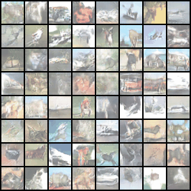 |  | 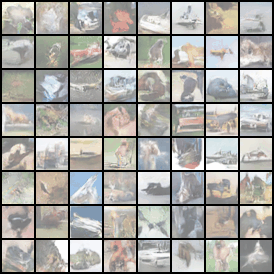 |

### $64 \times 64$
| 动画 | 10 Epochs | 50 Epochs | 100 Epochs |
| ------- | ------- | ------- | ------- |
|  | 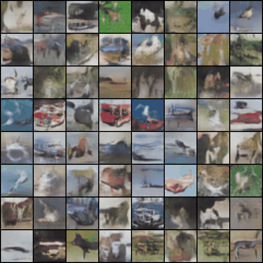 | 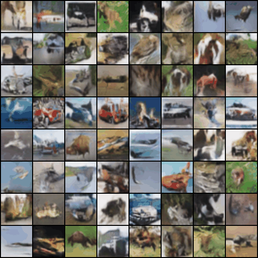 | 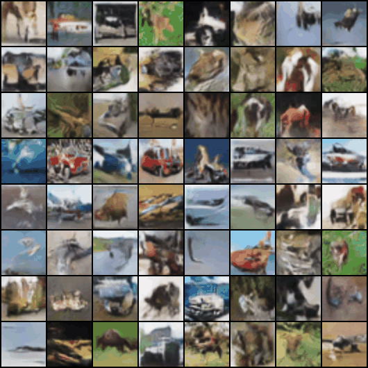 |

### $96 \times 96$
| 动画 | 10 Epochs | 50 Epochs | 100 Epochs |
| ------- | ------- | ------- | ------- |
|  |  |  |  |

## 7.3.CGAN
### $28 \times 28$
| 动画 | 10 Epochs | 50 Epochs | 100 Epochs |
| ------- | ------- | ------- | ------- |
|  | 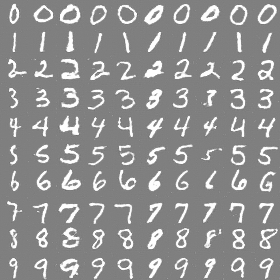 | 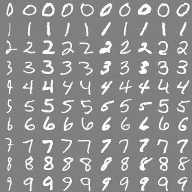 | 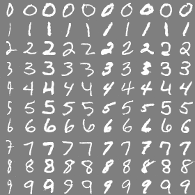 |

### $32 \times 32$
| 动画 | 10 Epochs | 50 Epochs | 100 Epochs |
| ------- | ------- | ------- | ------- |
|  |  |  | 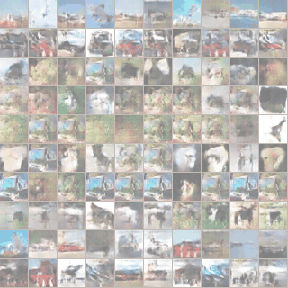 |

### $64 \times 64$
| 动画 | 10 Epochs | 50 Epochs | 100 Epochs |
| ------- | ------- | ------- | ------- |
|  | 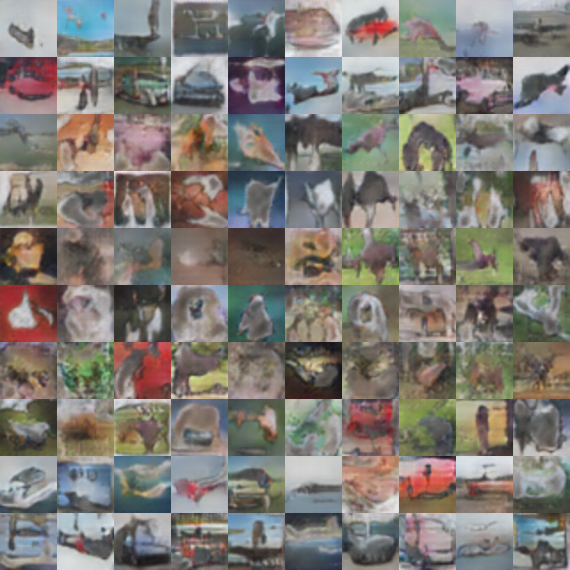 |  | 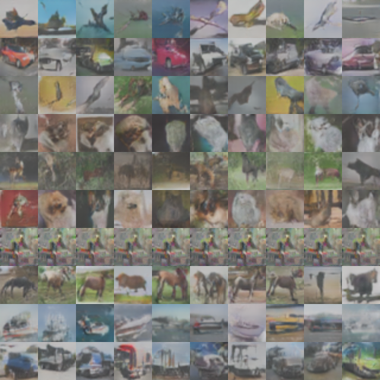 |

### $96 \times 96$

## 7.4.infoGAN
### $28 \times 28$
| 动画 | 10 Epochs | 30 Epochs | 50 Epochs |
| ------- | ------- | ------- | ------- |
|  |  |  | 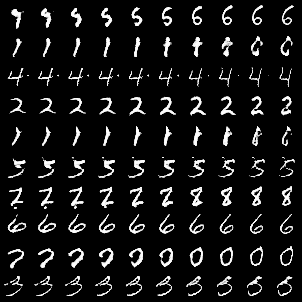 |

### $32 \times 32$

### $64 \times 64$

### $96 \times 96$

## 7.5.WGAN
### $28 \times 28$
| 动画 | 10 Epochs | 50 Epochs | 100 Epochs |
| ------- | ------- | ------- | ------- |
| 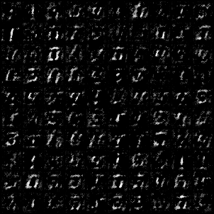 | 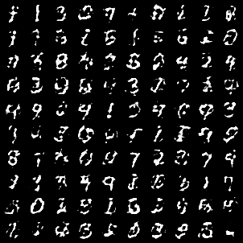 |  |  |

### $32 \times 32$
| 动画 | 10 Epochs | 50 Epochs | 100 Epochs |
| ------- | ------- | ------- | ------- |
|  | 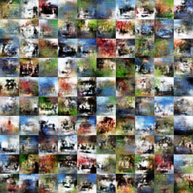 |  |  |
