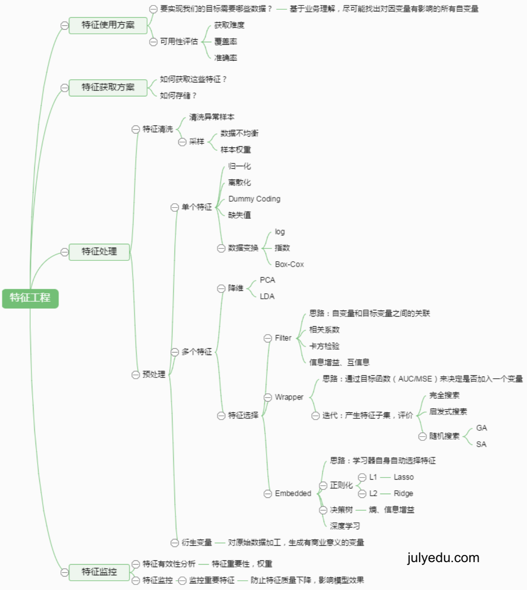

Kaggle竞赛
===
# 1.机器学习问题的解决思路
## 1.1.了解数据-可视化

## 1.2.选择最贴切的机器学习算法

## 1.3.定位模型状态(过/欠拟合)以及解决办法
增大样本量、增大正则化的系数

## 1.4.大量极的数据的特征分析和可视化

## 1.5.各种损失函数的优缺点及如何选择

# 2.Kaggle竞赛的解题思路
## 2.1.了解场景和目标

## 2.2.了解评估准则

## 2.3.认识数据

## 2.4.数据预处理(清洗、调权)
数据特征足够好，用很简单的模型都能获得很好的效果
### 2.4.1.数据清洗
- 不可信的样本丢掉
- 缺省值极多的字段考虑不用

### 2.4.2.数据采样
- 上采样或下采样
- 保证样本均衡

比如如果正负样本的比率是10：100，那么只要过来一个测试数据，你判断它为负样本，那么这个模型的正确率是很高的，但
是这个模型根本没有用，所以必须保证样本的均衡性，可以采用如下方法解决这个问题：
1. 将正样本重复若干次，也就是上采样
2. 增大最后的loss function中正样本导致的损失的权重
3. 使用Bagging等集成分类算法，比如讲负样本分成10份，每一份数据和正样本都组成一个集合，进行一个预测，最后就
有10个分类器，然后用集成算法

## 2.5.特征工程
 
sklearn.feature_extraction和sklearn.processing

## 2.6.模型调参

## 2.7.模型状态分析

## 2.8.模型融合